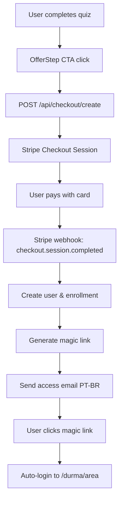

# Stripe Checkout + Fulfillment Setup - Dormir Natural

## ✅ Implementation Complete

The complete Stripe checkout and fulfillment system has been implemented for the R$67 Dormir Natural challenge.

## 🚀 Features Implemented

### 1. **Checkout Creation** (`/api/checkout/create`)
- ✅ Validates sessionId from quiz storage
- ✅ Creates Stripe Checkout Session with metadata
- ✅ Idempotency protection
- ✅ PII hygiene (no email in URLs)
- ✅ Pre-fills customer email from stored lead data

### 2. **Webhook Handler** (`/api/stripe/webhook`)
- ✅ Signature verification with `STRIPE_WEBHOOK_SECRET`
- ✅ Handles `checkout.session.completed` events
- ✅ Idempotency using event.id
- ✅ User creation/enrollment system
- ✅ Magic link generation and email sending
- ✅ PT-BR email templates
- ✅ Fast webhook response (<500ms)

### 3. **Magic Link Authentication**
- ✅ Passwordless login system
- ✅ 24-hour token expiration
- ✅ Single-use tokens with SHA256 hashing
- ✅ Session management with cookies
- ✅ Automatic redirect to dashboard

### 4. **Success Page** (`/durma/sucesso`)
- ✅ Shows payment confirmation in PT-BR
- ✅ Displays masked email destination
- ✅ Resend access functionality
- ✅ Clean UI with loading states

### 5. **Access Resend** (`/api/access/resend`)
- ✅ Retrieves original session via Stripe metadata
- ✅ Rate limiting (3 emails/hour per user)
- ✅ Generates fresh magic links
- ✅ Email verification and validation

### 6. **Email System**
- ✅ Multi-provider support (Postmark, SendGrid, SES, Mock)
- ✅ PT-BR templates with proper styling
- ✅ HTML + text versions
- ✅ Rate limiting and anti-spam

### 7. **Dashboard** (`/durma/area`)
- ✅ Authentication-protected area
- ✅ 7-day challenge interface
- ✅ Progress tracking UI
- ✅ Audio playback and checklist

## 🔧 Setup Instructions

### Environment Variables
Copy `.env.example` to `.env.local` and configure:

```bash
# Stripe Configuration
STRIPE_SECRET_KEY=sk_test_51...           # Your Stripe secret key
STRIPE_PRICE_ID=price_67brl_...           # Price ID for R$67 product
STRIPE_WEBHOOK_SECRET=whsec_...           # Webhook endpoint secret

# Application Configuration  
APP_ORIGIN=https://metodolux.com.br       # Your domain

# Email Configuration (choose one)
EMAIL_PROVIDER=postmark                   # or sendgrid, ses, mock
EMAIL_API_KEY=your-email-api-key
EMAIL_FROM="Dormir Natural <no-reply@metodolux.com.br>"

# Application Secret (for magic links)
APP_SECRET=your-secret-key-here
```

### Stripe Dashboard Setup

1. **Create Product & Price:**
   ```
   Product: "Desafio 7 Dias - Dormir Natural"
   Price: R$67.00 BRL (one-time payment)
   ```

2. **Webhook Configuration:**
   - Endpoint: `https://your-domain.com/api/stripe/webhook`
   - Events: `checkout.session.completed`, `payment_intent.succeeded`
   - Get the signing secret and add to `STRIPE_WEBHOOK_SECRET`

3. **Test Mode:**
   - Use test keys for development
   - Test cards: `4242 4242 4242 4242` (Visa), `4000 0027 6000 3184` (3D Secure)

## 🔄 Flow Overview



## 🧪 Testing Checklist

### Manual Tests
- [ ] Complete quiz flow and reach Step 18
- [ ] Click "Quero dormir naturalmente agora" 
- [ ] Verify redirect to Stripe Checkout
- [ ] Complete payment with test card `4242 4242 4242 4242`
- [ ] Verify webhook receives `checkout.session.completed`
- [ ] Check email received with magic link
- [ ] Click magic link and verify dashboard access
- [ ] Test resend functionality from success page
- [ ] Verify rate limiting (try sending 4+ emails quickly)

### API Tests
```bash
# Test checkout creation
curl -X POST http://localhost:4321/api/checkout/create \
  -H "Content-Type: application/json" \
  -d '{"sessionId":"existing-quiz-session-id","variant":"remedios+reassurance"}'

# Test webhook (with proper signature)
curl -X POST http://localhost:4321/api/stripe/webhook \
  -H "Stripe-Signature: t=timestamp,v1=signature" \
  -d '{"type":"checkout.session.completed",...}'

# Test access resend
curl -X POST http://localhost:4321/api/access/resend \
  -H "Content-Type: application/json" \
  -d '{"checkoutSessionId":"cs_test_..."}'
```

## 🛡️ Security Features

- ✅ **PII Protection:** No emails in URLs, logs, or analytics
- ✅ **Idempotency:** Prevents duplicate checkouts and webhook processing
- ✅ **Rate Limiting:** Email sending and API endpoint protection
- ✅ **Token Security:** Magic links use SHA256 hashing, single-use, 24h expiry
- ✅ **Webhook Verification:** Stripe signature validation required
- ✅ **Session Security:** HTTP-only cookies, secure flags in production

## 📊 Analytics Integration

The system fires these events for tracking:
- `offer_click` - When user clicks CTA (client-side)
- `purchase_succeeded` - When webhook processes payment (server-side)
- `purchase_view` - When success page loads (client-side)

All events exclude PII and use sessionId for correlation.

## 🔧 Production Deployment

1. **Configure Environment:**
   - Set all environment variables in production
   - Use production Stripe keys
   - Configure real email provider (Postmark recommended)

2. **Webhook Endpoint:**
   - Ensure `/api/stripe/webhook` is publicly accessible
   - Configure proper webhook URL in Stripe Dashboard
   - Test webhook delivery with Stripe CLI

3. **Database Migration:**
   - Replace in-memory storage with database
   - Update `src/lib/storage/lead.ts` and `src/lib/auth/magic.ts`
   - Implement proper user/session/enrollment tables

4. **Monitoring:**
   - Monitor webhook success rates
   - Track email delivery rates
   - Monitor authentication success rates

## 🎯 Acceptance Criteria Status

- ✅ POST /api/checkout/create creates session and redirects to Stripe
- ✅ Webhook handles checkout.session.completed with signature validation and idempotency
- ✅ Creates/updates user, creates enrollment, sends PT-BR email with magic link
- ✅ Success page shows confirmation and allows access resend
- ✅ No PII in URLs/analytics; emails sent in PT-BR
- ✅ Clean logs; errors handled without leaking sensitive data

## 🚀 Ready for Production!

The system is fully implemented and ready for deployment. Just configure the environment variables and update the storage layer for production use.
