# Supabase Integration Report

## Overview

Successfully integrated Supabase as the primary database for the Meditha project, replacing in-memory storage with a production-ready PostgreSQL database with Row Level Security (RLS). All API endpoints have been updated to use Supabase with proper security measures.

## ✅ Completed Tasks

### Infrastructure Setup
- **✅ Supabase Dependencies**: Installed `@supabase/supabase-js`
- **✅ Environment Variables**: Updated `.env.example` with Supabase configuration
- **✅ Client Factory**: Created secure Supabase client factory in `src/lib/supabase.ts`

### Database Schema & Migrations
- **✅ Database Migrations**: Created two migration files:
  - `supabase/migrations/001_init.sql` - Complete schema with all tables and indexes
  - `supabase/migrations/002_policies.sql` - RLS policies for security

### Tables Created:
1. `quiz_sessions` - PII data for quiz completions with consent tracking
2. `checkout_intents` - Idempotent checkout session tracking
3. `stripe_checkout` - Stripe session mapping and metadata
4. `webhook_events` - Webhook event idempotency and audit trail
5. `payments` - Payment records and fulfillment status
6. `users_app` - User accounts for product access
7. `enrollments` - User enrollment in products/courses
8. `magic_links` - Secure token-based authentication
9. `email_log` - Email delivery tracking and audit
10. `product_events` - Non-PII telemetry and analytics

### API Endpoints Updated
- **✅ `/api/lead`**: Quiz session data storage with consent tracking
- **✅ `/api/checkout/create`**: Checkout intent creation and Stripe session storage
- **✅ `/api/stripe/webhook`**: Payment processing, user creation, and fulfillment
- **✅ `/api/access/resend`**: Magic link regeneration with rate limiting

### Authentication System
- **✅ Magic Link Auth**: Complete rewrite using Supabase with secure token hashing
- **✅ User Management**: User upserts, enrollment tracking, and session management
- **✅ Security**: SHA-256 token hashing, expiry tracking, single-use enforcement

### Email System
- **✅ Provider Wrapper**: Multi-provider support (Postmark, SendGrid, SES, Mock)
- **✅ Database Logging**: All emails logged to `email_log` table
- **✅ Rate Limiting**: Supabase-based rate limiting for anti-spam

### Client-Side Telemetry
- **✅ Non-PII Events**: Safe client-side event tracking
- **✅ PII Sanitization**: Automatic removal of sensitive data
- **✅ Event Helpers**: Pre-built functions for common tracking events

## 🔒 Security Features

### Row Level Security (RLS)
- **Enabled on all tables** with policies that default to deny access
- **Service role bypasses RLS** for server-side operations
- **Anonymous users** can only insert non-PII telemetry events

### Environment Variables
- **`SUPABASE_SERVICE_ROLE_KEY`** - Server-only, never exposed to client
- **`SUPABASE_ANON_KEY`** - Public key for client-side telemetry only
- **Proper separation** between admin and public operations

### Data Protection
- **PII isolation** - All sensitive data requires server-side service role access
- **Token hashing** - Magic link tokens stored as SHA-256 hashes only
- **Audit trails** - All webhook events and emails logged for compliance

## 📊 Database Architecture

```mermaid
graph TD
    A[quiz_sessions] --> B[checkout_intents]
    B --> C[stripe_checkout]
    C --> D[payments]
    A --> D
    D --> E[users_app]
    E --> F[enrollments]
    E --> G[magic_links]
    E --> H[email_log]
    I[webhook_events] -.-> D
    A --> J[product_events]
    
    A[quiz_sessions<br/>📝 PII: nome, email, answers]
    B[checkout_intents<br/>🛒 Idempotent checkout tracking]
    C[stripe_checkout<br/>💳 Stripe session mapping]
    D[payments<br/>💰 Source of truth for payments]
    E[users_app<br/>👥 User accounts]
    F[enrollments<br/>🎓 Course/product access]
    G[magic_links<br/>🔐 Authentication tokens]
    H[email_log<br/>📧 Email audit trail]
    I[webhook_events<br/>⚡ Webhook idempotency]
    J[product_events<br/>📊 Non-PII telemetry]
```



## 🚀 Deployment Instructions

### 1. Supabase Project Setup
```bash
# Create new Supabase project at supabase.com
# Note down project URL and keys
```

### 2. Environment Variables (Vercel)
```bash
# Add to Vercel Project Settings → Environment Variables:
SUPABASE_URL=https://your-project.supabase.co
SUPABASE_ANON_KEY=eyJ... (public anon key)
SUPABASE_SERVICE_ROLE_KEY=eyJ... (MARK AS ENCRYPTED/SERVER-ONLY!)
SUPABASE_DB_SCHEMA=public

# Keep existing variables:
STRIPE_SECRET_KEY=sk_...
STRIPE_PRICE_ID=price_...
STRIPE_WEBHOOK_SECRET=whsec_...
APP_ORIGIN=https://metodolux.com.br
EMAIL_PROVIDER=postmark
EMAIL_API_KEY=...
EMAIL_FROM="Dormir Natural <no-reply@metodolux.com.br>"
APP_SECRET=your-secret-key-here
```

### 3. Run Database Migrations
```bash
# Option A: Supabase SQL Editor
# Copy contents of each migration file and run in order:
# 1. supabase/migrations/001_init.sql
# 2. supabase/migrations/002_policies.sql

# Option B: Supabase CLI (if installed)
supabase db push
```

### 4. Stripe Webhook Configuration
```bash
# Update Stripe webhook endpoint to:
https://metodolux.com.br/api/stripe/webhook

# Ensure webhook events include:
# - checkout.session.completed
# - payment_intent.succeeded (optional)
```

### 5. Verify RLS is Active
```sql
-- Run in Supabase SQL editor to verify RLS:
SELECT schemaname, tablename, rowsecurity 
FROM pg_tables 
WHERE schemaname = 'public' AND rowsecurity = true;
-- Should return all 10 tables with rowsecurity = true
```

## 📈 Performance & Monitoring

### Indexes Created
- `quiz_sessions(email, started_at)` - Lead lookups and temporal queries
- `stripe_checkout(session_id)` - Checkout session mapping
- `payments(session_id, checkout_id)` - Payment reconciliation
- `magic_links(user_id, expires_at)` - Auth token cleanup
- `email_log(user_id, sent_at)` - User communication history
- `product_events(session_id, ts)` - Analytics queries

### Monitoring Recommendations
1. **Webhook Processing**: Monitor `webhook_events` table for failures
2. **Email Delivery**: Track `email_log` success rates
3. **Rate Limiting**: Monitor email sending frequency per user
4. **Token Usage**: Track `magic_links` usage and expiry patterns

## 🧪 Testing Recommendations

### Unit Tests
- Database adapter functions (`storeLead`, `createCheckoutIntent`)
- Magic link token generation and validation
- Email sending with proper logging
- Webhook event idempotency

### Integration Tests  
- Full quiz → checkout → payment → fulfillment flow
- Webhook processing with Stripe test events
- Rate limiting enforcement
- Email delivery and resend functionality

### Security Tests
- Verify RLS blocks unauthorized access
- Test service role vs anon key permissions
- Validate PII sanitization in telemetry
- Confirm token hashing and single-use enforcement

## 📋 Data Retention & GDPR Compliance

### Recommended Data Lifecycle
```sql
-- Example cleanup queries (implement as scheduled functions):

-- Anonymize old unconverted sessions (6 months)
UPDATE quiz_sessions 
SET nome = NULL, email = NULL 
WHERE consent = false 
  AND started_at < NOW() - INTERVAL '6 months';

-- Clean up expired magic links (monthly)
DELETE FROM magic_links 
WHERE expires_at < NOW() - INTERVAL '7 days';

-- Archive old webhook events (retain minimal data, 1 year)
DELETE FROM webhook_events 
WHERE received_at < NOW() - INTERVAL '1 year';
```

### GDPR Right to be Forgotten
For user deletion requests:
1. Delete from `users_app` (cascades to `enrollments`, `magic_links`)
2. Anonymize `quiz_sessions` and `email_log` entries
3. Retain aggregated analytics without PII

## 🎯 Next Steps

### Immediate (Post-Deployment)
1. **Monitor webhook processing** for first 24 hours
2. **Test email delivery** with real payments
3. **Verify RLS enforcement** with production data
4. **Set up database backups** in Supabase dashboard

### Future Enhancements
1. **Admin Dashboard**: Create interface for user management
2. **Analytics Queries**: Build reporting on `product_events`
3. **Data Retention**: Implement automated cleanup jobs
4. **A/B Testing**: Enhance experiment tracking capabilities

## 📞 Support & Troubleshooting

### Common Issues
- **"Service role not found"**: Check `SUPABASE_SERVICE_ROLE_KEY` is encrypted in Vercel
- **RLS denying access**: Verify using `supabaseAdmin()` in server routes
- **Webhook failures**: Check event storage in `webhook_events` table
- **Email not sending**: Review `email_log` for error details

### Logging & Debugging
- All major operations log to console with session/user IDs
- Database errors are caught and logged without exposing SQL
- Webhook events store full payload for debugging
- Email delivery tracked with provider message IDs

---

**Integration completed successfully** ✅  
**All API endpoints migrated to Supabase** ✅  
**Security measures implemented** ✅  
**Ready for production deployment** ✅
